class: center, middle

# Capítulo 6

### Gráficos de Controle para Processos Autocorrelacionados

---
class: inverse, center, middle

# Vamos lá!

---

# Gráficos de Controle para Processos Autocorrelacionados

##6.1 INTRODUÇÃO


--

- Para um gráfico de controle convencional e necessário que as observações sejam independentes e normalmente distribuídas porem se a hipótese de normalidade for violada ainda sim os gráficos de controle funcionam bem pois como exemplo as estatísticas R e S seguem distribuição diferente da normal , já a violação da hipótese independência reduz a aplicabilidade dos gráficos convencionais;


--

- Quando esses valores possuem alguma interdependência ou autocorrelação a probabilidade da observação cair fora dos limites de controle aumenta e compromete a credibilidade dos dados.


---
# Gráficos de Controle para Processos Autocorrelacionados

##6.2 COEFICIENTE DE CORRELAÇÃO E FUNÇÃO DE AUTOCORRELAÇÃO

- O coeficiente de correlação ρxy entre duas variáveis aleatórias X e Y e definido como:

--

- $𝜌_{AB} = \dfrac{𝐸[(𝑋−µ_𝑋 )(𝑌−µ_𝑌 )]}{(𝜎_𝑋 𝜎_𝑌)}$

--

- Que está sempre no intervalo [-1,1] em modulo quanto mais próximo de 1 maior o grau de dependência entre elas;

--

- O coeficiente de correlação entre X e Y pode ser estimado pelo coeficiente de correlação amostral 𝑟_𝑋𝑌 obtidos entre uma amostra de n pares (xi, yi);


---
# Gráficos de Controle para Processos Autocorrelacionados

- Podemos observar isto por meio do gráfico de dispersão onde quanto mais “arredondada” menor o coeficiente de correlação e quanto mais “afilada”, ou seja, parecida com uma reta maior o coeficiente de correlação como exemplo temos um gráfico de dispersão com aparência afilada e  $𝑟_{𝑋𝑌}=0,9$

--
#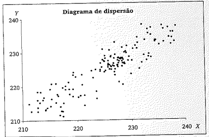

---

# Gráficos de Controle para Processos Autocorrelacionados

- Como estamos interessadas na correlação entre observações sucessivas de uma mesma característica de qualidade X e como queremos a correlação entre Xi Xi-k com k indicando a defasagem entre as observações neste caso a expressão do coeficiente de autocorrelação amostral será

--

- $r_{k} = \dfrac{\sum_{i=k+1}^n(xi-\bar{X})(x_{i-k}-\bar{X})}{\sum_{i=1}^n(xi-\bar{X})²}$

--

- O conjunto calculado pela expressão e chamado de função de autocorrelação amostral da serie de dados Xi.

---
# Gráficos de Controle para Processos Autocorrelacionados

##6.3 EXEMPLO DE UM PROCESSO AUTOCORRELACIONADO 

- Trás um exemplo pronto onde o coeficiente de correlação e alto e indica que viria a trazer problemas para os gráficos convencionais ele mostra o gráfico de medias que indica **12 dos 20 pontos** fora dos limite;

--
#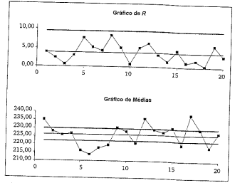

---
# Gráficos de Controle para Processos Autocorrelacionados

##6.4 GRAFICO DE OBSERVAÇÕES INDIVIDUAIS E AMPLITUDE MOVEL

- Como vimos os limites de controle quando as observações não são independentes tendem a ter muitas observações fora dos limites . uma alternativa para o controle do processos auto correlacionados consiste em **espaçar as medias por um intervalo de tempo suficientemente longo**, os gráficos de média e amplitude são substituídos pelos *gráficos de observações individuais* e *amplitude móvel* , ou *“gráfico de X e MR”*;

--

- A amplitude móvel e dada por $(MR_i)$

--

- $MR_i=máx(x_i,x_{i-1})-mín(x_i,x_{i-1})$

---
# Gráficos de Controle para Processos Autocorrelacionados

--
- A partir de um conjunto de m amostras, podemos estimar a média e desvio-padrão do processo:

--

- $\bar{µ}_0 =\bar{𝑋}=\sum_{i=1}^mx_i$

--

- $\bar{𝜎}_0 =Sd=\dfrac{\bar{MR}}{d2}$

--

- $\bar{MR}=\dfrac{\sum_{i=2}^m MR_i}{m-1}$

--

- Limites de controle- Média:

#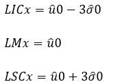


---
# Gráficos de Controle para Processos Autocorrelacionados

- Limites de controle- Amplitude:

--
#

--
- Para determinar o intervalo de tempo entre as amostras para que não haja autocorrelação, basta calcular o **rk** para diversos espaçamentos de tempo e verificar o menor valor de k que satisfaça $𝑟𝑘<2/\sqrt{𝑁}$, onde **N** é o número de observações individuais usadas para o cálculo dos coeficientes de correlação amostrais rk.

--

- Recomenda-se usar no mínimo 80 observações (N ≥ 80).


---
# Gráficos de Controle para Processos Autocorrelacionados

##6.5 GRAFICOS DE CONTROLE COM LIMITES ALARGADOS 

- Processos discretos, em especial os total ou parcialmente automatizados, também podem exibir **autocorrelação**. É possível monitorar esses processos com gráficos de X e MR, porém não é interessante por serem baseados em observações individuais espaçadas no tempo. Uma forma de monitorar a variabilidade de curto prazo é retirar as amostras com *n > 1*, o que nos leva a gráficos de 𝑋e R.

--

- Para evitar que ocorra muitos alarmes falsos, deve-se alargar adequadamente os limites de controle do gráfico de $\bar{X}$, com base na variabilidade total de $\bar{X}$.Sabendo disso, temos:

---
# Gráficos de Controle para Processos Autocorrelacionados

--
#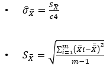

--
- Com **m** sendo o número de amostras iniciais e **c4** sendo determinado pelo número m. 

--
- Limites de controle - Média:

--
#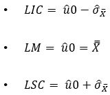

--
- Limites de controle - Amplitude: é mantido na forma usual pois “flutuações” da média do processo não afetam a dispersão intra-amostral.

---

class: inverse, middle, center

#Exemplo 1

---

- Suponha que se realize uma medida da temperatura do banho químico a cada 60 minutos; a primeira medida realizada às 8h30. Os valores obtidos seriam as temperaturas $X_{11}$, $X_{31}$ , $X_{51}$, $X_{71}$, e assim por diante, da Tabela 6.1 (que contém valores da temperatura do banho químico medidos a cada 3 minutos). Decorridas 20 horas, obter-se-iam as 20 medidas registradas na coluna X da Tabela 6.5.

--
- Essa tabela fornece ainda os valores de MR de cada amostra, e as médias X e MR.

--
```{r echo=FALSE, out.width = "40%", fig.align = "center"}
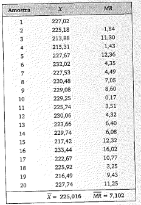
```

---

- Aplicando as fórmulas: $LIC_{MR} = 0$;  $LM_{MR} = 7,102$;  $LSC_{MR} = 23,202$;

--
- $LIC_{X} = 206,128$;  $LM_X = 225,016$; e $LSC_X = 243,904$.

--
- Os gráficos estão na Figura 6.4. Todos os pontos estão dentro dos limites, não há, portanto, indicação de descontrole do processo. (Isso reforça a evidência de que os pontos fora dos limites do gráfico de X da seção anterior são alarmes falsos.)

--
```{r echo=FALSE, out.width = "54%", fig.align = "center"}
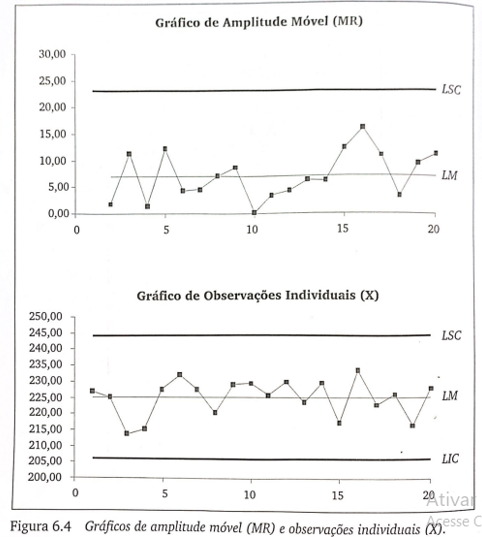
```

---

- Nesse exemplo, não apenas reduzimos o tamanho das amostras para n = 1, mas também adotamos um intervalo de tempo entre observações suficientemente longo para o efeito da **autocorrelação dissipar-se**. 

- No nosso caso, *N = 150*; portanto $\dfrac{2}{√𝑁} = 0,163$ . 

- Como a série inicial contém observações espaçadas de 3 minutos,   k = 10 corresponde a 30 minutos, k = 20 a uma hora, k = 40 a duas horas, e assim por diante.  

- A Tabela 6.3 mostra que r19= 0,155 é o primeiro valor de r, menor que 0,163; portanto, o espaçamento mínimo entre observações deve ser de 19 × 3 = 57 minutos. 

- Espaçamentos maiores garantem a independência das observações com maior margem de segurança, como foi o caso do intervalo de uma hora (k = 20) empregado. **O próximo exemplo ilustra o caso em que o intervalo de tempo adotado não é suficientemente longo para dissipar o efeito da autocorrelação.**


---

class: inverse, middle, center

#Exemplo 2

---

```{r echo=FALSE, out.width = "60%", fig.align = "center"}
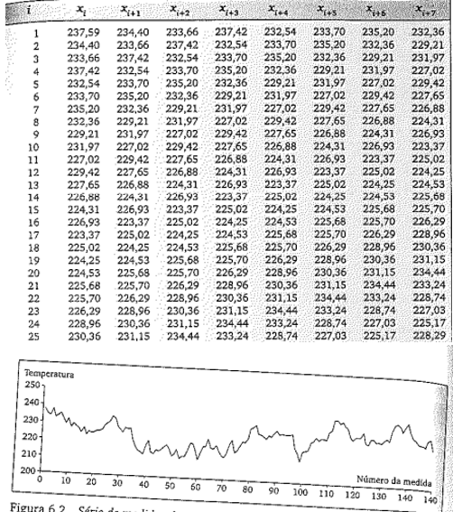
```

---

```{r echo=FALSE, out.width = "60%", fig.align = "center"}
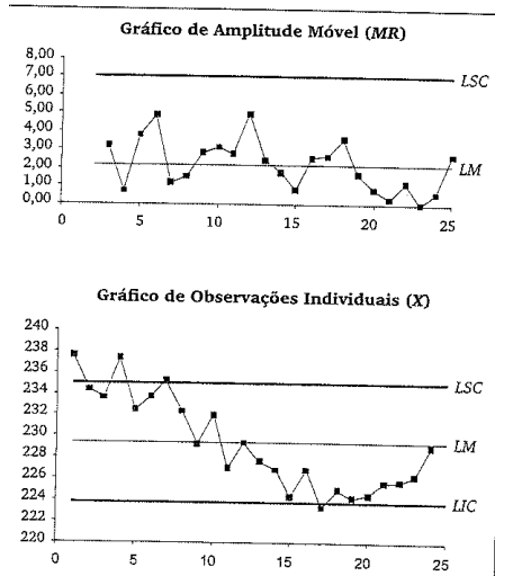
```

---


class: inverse, middle, center

#Exemplo 3

---

- Vamos considerar a tabelo e o gráfico a seguir, relativos aos volumes de refrigerante em garrafas plásticas, cujo valor-alvo é 1000ml;

--
```{r echo=FALSE, out.width = "50%", fig.align = "center"}
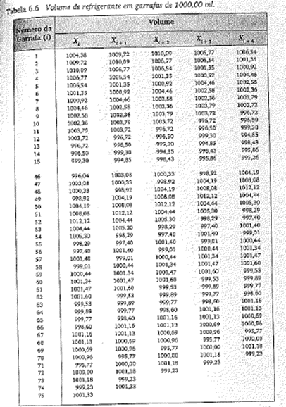
```
---
```{r echo=FALSE, out.width = "70%", fig.align = "center"}
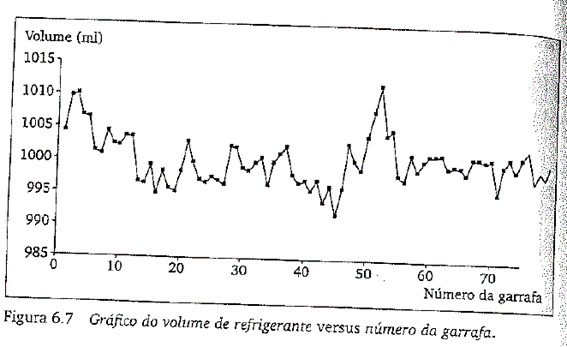
```

--
- A tabela 6.7 apresenta os cálculos intermediários necessários para a obtenção do coeficiente de autocorrelação amostral para k=1; r=693,509/1061,164=0,654. Esse valor representa forte autocorrelação positiva. Os coeficientes de autocorrelação $r_1$ a $r_4$ encontram-se na tabela 6.8.

---

```{r echo=FALSE, out.width = "50%", fig.align = "center"}
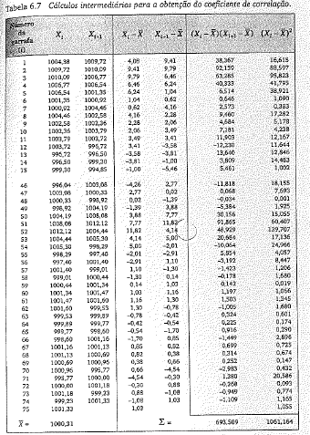
```
    
---

```{r echo=FALSE, out.width = "70%", fig.align = "center"}
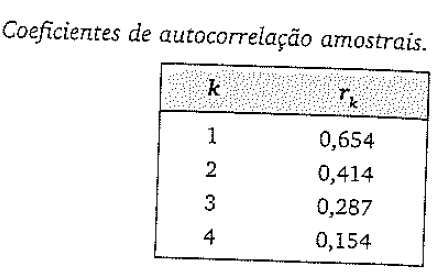
```

---

```{r echo=FALSE, out.width = "60%", fig.align = "center"}
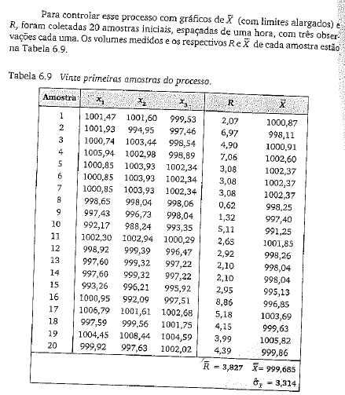
```

---
```{r echo=FALSE, out.width = "50%", fig.align = "center"}
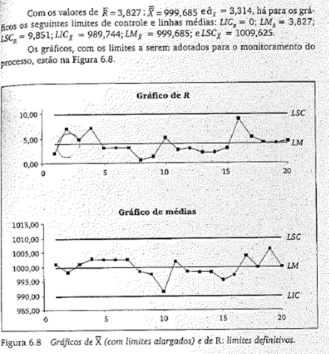
```

- Note que, se o estimador para o desvio-padrão do processo usado no calculo dos limites para o gráfico de $\bar{X}$ tivesse sido o estimador usual $\dfrac{\bar{X}}{d_2}$, o resultado seria $LIC_\bar{X} =995,769$ e $LSC_\bar{X} =1003,600$; vários pontos do gráfico de $\bar{X}$, então, estariam fora dos limites (nas amostras 10,15,17,19). Esses pontos seriam alarmes falsos.
    
---
class: inverse, middle, center

#Vamos ver ná prática
#Resolução Exercício 6.1

---